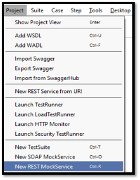

# test-tools

### Tutorial de como utilizar as ferramentas de testes Postman e SOAPUI

Antes de iniciarmos com as ferramentas, necessitamos de alguns conceitos de serviços:

### <ins>API (Application Programming Interface):</ins>

É uma interface que conecta dois programas, realizando a comunicação entre eles e especificando como seus softwares devem interagir.

##### Webservices:
São APIs que se comunicam por meio de redes e podem ser combinados para a execução de operações complexas, utilizando principalmente o HTTP (Hyper Text Transfer Protocol).

##### SOAP (Simple Object Access Protocol):
É um protocolo elaborado para facilitar a chamada remota de funções via Internet. O SOAP define também um padrão chamado WSDL que descreve os objetos e métodos disponíveis que retornam XML acessíveis através da Web.

Vantagens:
- Protocolo de transporte independente;
- Trabalha melhor com sistemas distribuídos, pois não trabalha com comunicação ponto-a-ponto;
- O arquivo WSDL pode gerar um certo tipo de automação quando usado com determinadas ferramentas;
- Utiliza formato XML.

##### REST (REpresentational State Transfer):
Consiste em princípios, regras, constraints que, quando seguidas, permitem a criação de um projeto com interfaces bem definidas. Este padrão expressa o que desejamos realizar ao acessar um determinado endereço, usando verbos específicos (GET, POST, PUT, DELETE) para URLs específicas e usando dados padronizados, quando necessário.

Vantagens:
- Melhor curva de aprendizado;
- Mensagens menores e mais eficientes;
- Os dados podem ser colocados em cache, retornando sempre a mesma resposta para a mesma requisição;
- Mais rápido pois precisa de menos processamento;
- Utiliza o protocolo HTTP.
- Utiliza formato JSON (principal), YAML, XML.

Obs: aplicações que utilizam o conceito REST são chamadas de RESTful.

##### MOCK:
São respostas que simulam o comportamento de serviços de forma controlada. São normalmente criados para testar o comportamento de uma aplicação.

---

### <ins>FERRAMENTA SOAPUI: (https://www.soapui.org/)</ins>
Esta ferramenta serve tanto para testarmos serviços REST (*JSON) e SOAP (XML), como também realizarmos MOCKs para os serviços.

#### 1. Testando serviços:

a. Para começarmos vamos testar o serviço dos correios (SOAP) e por isso iremos selecionar o ícone SOAP abaixo:<br>
   <br>
 	
b. Dê um nome para o projeto e cole a URL do serviço:<br>
   wsdl: http://webservice.correios.com.br/service/rastro/Rastro.wsdl<br>
   <br>
	
c. Preencha os dados conforme a documentação e consulte o serviço:<br>
   <br>

>[!NOTE]  
> Clique no ícone "Play" para realizar a consulta.

Documentação dos Correios: [manual integração](https://www.correios.com.br/atendimento/developers/arquivos/manual-para-integracao-via-web-services-sigep-web)

---

#### 2. Mockando serviços:

a. Crie um novo projeto vazio clicando em Empty e dê um nome para o projeto:<br>
   <br>

b. Crie um Rest MockService:<br>
   <br>

c. Dê um nome para o Mock:<br>
   <br>

d. Agora podemos configurar em qual porta o serviço irá rodar, e qual o caminho de acesso:<br>
   <br>

>[!NOTE]  
> Com as configurações atuais o nosso mock funcionará no localhost, porta 8080. URL: http://localhost:8080

e. Clique com o segundo botão do mouse no TestServices e adicione uma ação:<br>
   <br>

f. Adicione o método que deseja "mockar" e qual o nome do serviço (buscaEventos):<br>
   <br>

g. Realize uma consulta com sucesso no serviço original (Correios) e salve a resposta do serviço para poder usar posteriormente.<br>

h. Clique com o segundo botão do mouse em buscaEventos e adicione um Mock Response:<br>
   <br>

i. Dê um nome para o response, escolha o código de retorno, e em Content adicione a resposta desejada:<br>
   <br>

>[!NOTE]  
> Como este é um serviço SOAP, em Media type vamos escolher application/xml.

j. Clique no ícone "Play" para executar o mock:<br>
   <br>

Pronto! Clique em "Stop" para encerrar o mock.

---

### 3. Conteúdo Adicional:

O SOAPUI é uma ferramenta bem completa, onde é possível adicionar parâmetros e realizar scripts.

#### 3.1. Segue abaixo um exemplo de delay, útil para testar a demora de um serviço:

a. Duplo clique em TestService, clique em OnRequest Script (Salve o projeto para aparecer esta opção):<br>
   <br>
   
b. Adicione as linhas de código abaixo:<br>
   <br>

Pronto, agora toda vez que chamar o buscaEventos ele esperará 8 segundos para responder.

---

#### 3.2. Consumir o serviço de mock:

a. Crie um novo projeto REST, informe a URL do mock e realize uma consulta:<br>
   URL: http://localhost:8080/buscaEventos<br>
   <br>
   
b. Agora basta informar para a aplicação o endereço do mock e manipular os dados do retorno.

---

#### 3.3. Gerando documentação do webservice:

a. Para gerar a documentação do endpoint, clique com o segundo botão do mouse na interface do projeto e clique em “Generate Documentation”.<br>
   <br>
   
---

#### 3.4. Criando Testes:

a. Para iniciarmos os nossos testes, vamos utilizar como base o webservice dos correios. Para gerar automaticamente os testes de todos os resources, clique com o segundo botão do mouse e clique em “Generate TestSuite”:<br>
   <br>

b. Agora selecione para criar um teste para cada recurso, marque a opção de usar a request existente e dê um nome para o Test Suite:<br>
   <br>

>[!NOTE]  
> Se deixar marcada a opção de “Create new empty requests” terá de preencher todos os dados da requisição novamente.

c. Agora que já temos os testes, vamos adicionar as validações. Dê um duplo clique no teste desejado, clique em Assertions e no mais para abrir a caixa de validação:<br>
   <br>
   
d. Com a caixa aberta, escolha a opção “Contains” e digite o texto a ser validado (ex: NOVO HAMBURGO):<br>
   <br>
   
>[!NOTE]  
> Existem diversos tipos de validação, como por exemplo: código http, response, JSON, script etc. Este é apenas um exemplo simples de como validar.

e. Pronto, execute o teste e verifique que o ícone do assertions ficará verde, assim como o ícone SOAP do teste realizado.
   <br>

>[!NOTE]  
> Caso você queira criar manualmente um TestSuite, clique com o segundo botão do mouse no projeto e clique em “New TestSuite” (será criado vazio). Para criar um TestCase manualmente, vá no TestSuite, clique com o segundo botão do mouse e clique em “New TestCase”. Além de ser criado vazio, será necessário adicionar manualmente o tipo de requisição, endpoint e dados da requisição. Muito mais trabalhoso do que utilizar o modo automático. 

---

#### 3.5. Criando variáveis:

Como premissa para esta parte, vamos iniciar com o conceito de contexto: 
Contexto é a visibilidade/ alcance de quem pode acessar/ visualizar determinado elemento, no nosso caso, as variáveis. 
No SOAPUI podemos criar variáveis globais, de projeto, de testes, do caso de teste e do passo do teste. 
Tudo vai depender da sua necessidade.

**Criando variáveis globais:**  
a. Acesse Preferences/ Global Properties e clique no “+” para adicionar a variável e coloque o nome que desejar:<br>
   <br>
   
>[!NOTE]  
> Variáveis globais podem ser acessadas de qualquer projeto/ serviço.

b. Crie variáveis de projeto acessando a janela de propriedades do projeto:<br>
   <br>

>[!NOTE]  
> Agora basta chamar a variável para pegar o valor dela. Este passo serve para todos os demais casos, basta você ir no contexto desejado: testes, caso de teste e passo do teste e criá-los.

Agora que já temos a nossas variáveis, vamos trabalhar com elas. 

---

#### 3.6. Pegando valor da variável no request:

a. Para acessar as nossas variáveis, siga o padrão:<br>
   `${#Contexto#PropriedadeDesejada}`, no nosso caso `${#Project#codRastreamento}`<br>
   <br>
   
>[!NOTE]  
> Para pegar o valor de uma variável global, basta digitar:<br>
   `${#Global#PropriedadeDesejada}`

---

#### 3.7. Passando valores do Response para variável:

a. Para que isto ocorra, necessitamos que as variáveis estejam criadas e também os testes. Agora vamos no nosso caso de teste, clique com o segundo botão do mouse no passo do teste e clique em “Property Transfer”:<br>
   <br>
   
b. Dê um nome para a propriedade e clique no mais para adicionar as variáveis que receberão as informações:<br>
   <br>

c. Agora necessitamos informar em qual propriedade vamos procurar o valor, no nosso caso no Response:<br>
   <br>

d. Também devemos informar qual propriedade da resposta devemos pegar. Para isso, clique no “ns” (namespace) e adicione a propriedade da resposta conforme imagem:<br>
   <br>

>[!NOTE]  
> Caso no retorno do serviço contenha “:” na propriedade desejada, ex: ns2:buscaEventosResponse, adicione “*:propriedade” para evitar erros de “fetch” na captura do valor. 

e. Finalmente defina o destino do valor obtido enviando-o para uma variável, request de outro serviço, etc. No nosso caso vamos passar para a variável global:<br>
   <br>

>[!NOTE]  
> Ignore o erro dizendo que o Target não é um Request, o valor será preenchido com sucesso. Se você precisar preencher uma propriedade da requisição sem ser por variável, utilize o mesmo conceito de obter a propriedade da resposta. Selecione o caso de teste, propriedade Request, clique no namespace e informe qual campo será preenchido, por ex: objetos. 

---

#### 3.8. Criando scripts:

Esta é uma ferramenta excelente, com os scripts podemos realizar todos os tipos de validações, realizar requisições, preencher variáveis e muito mais. O Groovy script é o script do SOAPUI, ele é orientado a objetos e baseado na linguagem Java. Utilizá-lo necessita de um conhecimento prévio em programação. Deixando de lado a parte conceitual, vamos agora realizar algumas operações com ele:  

a. Gerando o script:<br>
Dentro do SOAPUI temos a possibilidade de criar os scripts dentro de um projeto mock ou real. Para ambos os casos, temos diferenças de contexto. Seguem as possibilidades detalhadas abaixo:<br>

<ins>Webservice real:</ins><br>
Para criar um script dentro de um webservice real, precisamos criar um Test Suite, e a partir deste momento, basta cria-lo no ponto que desejar (test suite, caso de teste, passo do teste, após a requisição etc.). 

>[!NOTE]  
> No nosso caso, clique com o segundo botão do mouse em cima da propriedade “Property Transfer” (dentro do passo de teste) e insira um groove script. 

<ins>Servidor Mock:</ins><br>
Aqui, diferentemente do webservice real, podemos criar o script nos seguintes pontos:<br>

**Interface do projeto:**<br>
- “Start Script” (executado após iniciar o mock) e “Stop Script” (executado após finalizar o mock), normalmente são utilizadas para compartilhar variáveis e conexões. 
- “On Request Script”, empregado para simular alguma situação em serviços REST. 
- “After Request Script”, geralmente utilizado para logar informações.<br>

**Resource do projeto:**<br>
- “Dispatch Script”, empregado para definir qual response chamar.

**Response do resource:**<br>
- “Script”, antes de retornar o valor mockado é possível manipular os dados, serve para gerar dados dinâmicos. 

<ins>Ambos os casos (mock e real):</ins><br>
**Raiz do projeto:**<br>
- “Load Script” (chamado ao carregar o projeto) e o “Save Script” (invocado após salvar o projeto), o primeiro serve para iniciar dados da sessão, endpoints etc. Já o segundo, serve para limpar variáveis, testes etc. 

b. Logando, recuperando e definindo valores de variáveis:<br>
Para logar simplesmente utilize a sintaxe:<br>
```
log.info(“Hello world”);
```

Antes de continuarmos com o log, precisamos de alguns conceitos para pegar a variável. Existem duas formas de pegar o valor delas, uma estendendo o contexto e outra com o conceito de get Java.<br>

Pegando a variável estendendo o contexto:<br>
```
//utilize a sintaxe abaixo e passe o valor da variável igual ao item 3.6 adicionando ''
def globalCidade = context.expand('${#Global#cidade}'); 
```

Pegando a variável via get:<br>
Aqui precisaremos analisar o local em que estamos codificando, seguem as tabelas de regras:<br>
```
Dentro do Test Suite:
def testCaseProperty = testRunner.testCase.getPropertyValue("MyProp"); 
def testSuiteProperty = testRunner.testCase.testSuite.getPropertyValue( "MyProp" ); 
def projectProperty = testRunner.testCase.testSuite.project.getPropertyValue( "MyProp" ); 
def globalProperty = com.eviware.soapui.SoapUI.globalProperties.getPropertyValue( "MyProp" );
```

Importante, dentro da validação de um caso de teste você pode inserir um script (Script Assertion), nesse caso, a forma de pegar as variáveis muda, pois o objeto testRunner não estará disponível: 
```
Dentro da validação do teste:
def testCaseProperty = messageExchange.modelItem.testStep.testCase.getPropertyValue( "MyProp" ); 
def testSuiteProperty = messageExchange.modelItem.testStep.testCase.testSuite.getPropertyValue( "MyProp" ); 
def projectProperty = messageExchange.modelItem.testStep.testCase.testSuite.project.getPropertyValue( "MyProp" ); 
def globalProperty = com.eviware.soapui.SoapUI.globalProperties.getPropertyValue( "MyProp" );
```

Exemplos: 
- Raiz do projeto:
```
//Get de variável global por contexto
def gCidade = context.expand('${#Global#cidade}'); 
```

```
//Get de variável global
def gCidade = com.eviware.soapui.SoapUI.globalProperties.getPropertyValue('cidade');
```

```
//Get Projeto
def prj = project.workspace.getProjectByName("RastreamentoCorreios");
```

```
//Get TestSuite
def tSuite = prj.testSuites['RastreamentoTestSuite'];
```

```
//Get TestCase
def tCase = tSuite.testCases['buscaEventos TestCase'];
```

```
//Get TestStep
def tStep = tCase.getTestStepByName("buscaEventos");
```

```
//Get Variável do TestCase
def tcVar = tCase.getPropertyValue('test');
```

```
//Regras de variável por contexto
Project ${#Project#PropertyName} 
TestSuite ${#TestSuite#PropertyName} 
TestCase ${#TestCase#PropertyName} 
TestStep ${#TestStepName#PropertyName} 
System ${#System#PropertyName} 
Env ${#Env#PropertyName} 
Global ${#Global#PropertyName}
```

Dando continuidade, para definirmos um valor de uma variável, precisamos utilizar a seguinte sintaxe: 
```
//Utilizaremos o mesmo conceito do get mas substituindo por:
setPropertyValue("MyProp", someValue ) 
tCase.setPropertyValue("test", "Novo valor");
```

Exemplos: 
```
//Project
testRunner.testCase.testSuite.project.setPropertyValue("MyProp", "Project"); 
//TestSuite 
testRunner.testCase.testSuite.setPropertyValue("MyProp", "TestSuite"); 
//TestCase 
testRunner.testCase.setPropertyValue("MyProp", "TestCase"); 
//TestStep 
testRunner.testCase.getTestStepByName("Example").setPropertyValue("MyProp", "Test Step"); 
//Global 
com.eviware.soapui.SoapUI.globalProperties.setPropertyValue("MyProp", "Global");
```

Agora vamos logar nossas variáveis criadas (cidade e codRastreamento): 
```
def gCidade = com.eviware.soapui.SoapUI.globalProperties.getPropertyValue('cidade');
log.info(gCidade); 
def tCase = Project. testSuites['RastreamentoTestSuite']. testCases['buscaEventos TestCase']; 
def tcVar = tCase.getPropertyValue('test'); 
log.info(tcVar);
```

c. Adicionando, removendo e iterando nas propriedades:<br>
Para adicionar uma propriedade utilize a sintaxe:<br>
```
testRunner.testCase.testSuite.project.addProperty("newProperty");
```

Remova uma propriedade com o código: 
```
testRunner.testCase.testSuite.project.removeProperty("newProperty");
```

Itere sobre as propriedades com a sintaxe: 
```
tCase.properties.each{
 key, value -> 
 log.info (key + " - " + tCase.getPropertyValue(key)); 
} 
for(item in tCase.properties){ 
 log.info(tCase.getPropertyValue(item.key)); 
}
```

>[!NOTE]  
> Utilizamos o getPropertyValue para pegar o conteúdo, pois em value está o endereço do valor. 

d. Executando um teste e trabalhando com o response:<br>
Para executar um teste, dentro de um TestSuite, faça o seguinte código: 
```
testStep.run(testRunner, context);
```

E para finalizar, vamos ler o resultado e pegar os seus valores: 
```
//precisamos dessas ferramentas para trabalharmos com o XML
def groovyUtils = new com.eviware.soapui.support.GroovyUtils(context); 
//Agora indicamos o que vamos ler 
def holder = groovyUtils.getXmlHolder("buscaEventos#Response"); 
//Aqui pegamos todos os nomes e valores do retorno 
def nodeNames = holder.getDomNodes("//*"); 
def nodeValues = holder.getNodeValues("//*"); 
//Por fim, lemos todos os valores 
for (i = 0; i < nodeNames.size(); i++) { 
 log.info("Node: [" + nodeNames[i].getTagName() + "] - Value: [" + nodeValues[i].trim() + "]"); 
}
```

>[!NOTE]  
> Agora que já todos os valores da resposta, podemos por ex, atualizar a variável global “cidade” que criamos anteriormente.

---

### 4. Observações Finais:

O mock só funciona localmente, para funcionar na aplicação o SOAPUI deve estar instalado no servidor de testes.

O exemplo de mock trabalhado é simples, e não tivemos a necessidade de passar parâmetros, adicionar informações no header, etc.

Também vimos como gerar documentação, criar variáveis, passar valores, realizar testes e scripts. 

Por último, esta ferramenta possui o teste de carga, onde utilizamos para validar se um webservice, site, banco de dados estão aguentando um determinado tráfego. 

IMPORTANTE:
SOAPUI versão 5.5.0, build 20190211-1036

---
