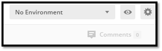
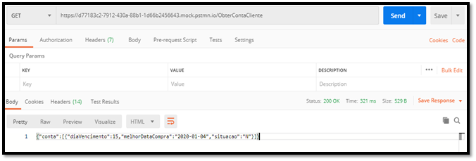

# test-tools

<a name="home"></a>
### Indice

- [O que e API](#api)
- [Postman](#postman)
- [SoapUI](#soap-ui)
- [Consideracoes Finais](#consideracoes)

---
### Tutorial de como utilizar as ferramentas de testes Postman e SOAPUI

Antes de iniciarmos com as ferramentas, necessitamos de alguns conceitos de serviços:

<a name="api"></a>
### <ins>API (Application Programming Interface):</ins> - [**[indice]**](#home)

É uma interface que conecta dois programas, realizando a comunicação entre eles e especificando como seus softwares devem interagir.

##### Webservices:
São APIs que se comunicam por meio de redes e podem ser combinados para a execução de operações complexas, utilizando principalmente o HTTP (Hyper Text Transfer Protocol).

##### SOAP (Simple Object Access Protocol):
É um protocolo elaborado para facilitar a chamada remota de funções via Internet. O SOAP define também um padrão chamado WSDL que descreve os objetos e métodos disponíveis que retornam XML acessíveis através da Web.

Vantagens:
- Protocolo de transporte independente;
- Trabalha melhor com sistemas distribuídos, pois não trabalha com comunicação ponto-a-ponto;
- O arquivo WSDL pode gerar um certo tipo de automação quando usado com determinadas ferramentas;
- Utiliza formato XML.

##### REST (REpresentational State Transfer):
Consiste em princípios, regras, constraints que, quando seguidas, permitem a criação de um projeto com interfaces bem definidas. Este padrão expressa o que desejamos realizar ao acessar um determinado endereço, usando verbos específicos (GET, POST, PUT, DELETE) para URLs específicas e usando dados padronizados, quando necessário.

Vantagens:
- Melhor curva de aprendizado;
- Mensagens menores e mais eficientes;
- Os dados podem ser colocados em cache, retornando sempre a mesma resposta para a mesma requisição;
- Mais rápido pois precisa de menos processamento;
- Utiliza o protocolo HTTP.
- Utiliza formato JSON (principal), YAML, XML.

Obs: aplicações que utilizam o conceito REST são chamadas de RESTful.

##### MOCK:
São respostas que simulam o comportamento de serviços de forma controlada. São normalmente criados para testar o comportamento de uma aplicação.

---
<a name="postman"></a>
### <ins>FFERRAMENTA POSTMAN: (https://www.postman.com/)</ins> - [**[indice]**](#home)
Esta ferramenta também serve para testarmos serviços REST (*JSON), SOAP (XML) e realizarmos MOCKs para os serviços.

#### 1. Testando serviços SOAP:

a. Para começarmos vamos testar o serviço dos correios (SOAP) e por isso iremos selecionar o ícone SOAP abaixo:<br>
   <br>

b. Adicione os seguintes parâmetros no Header da Requisição:<br>
```
SOAPAction: "https://www.w3schools.com/xml/FahrenheitToCelsius"
Content-Type: text/xml
```
   <br>

c. Clique na aba Body, selecione a opção raw/XML e adicione o seguinte conteúdo:<br>
   <br>
```
<?xml version="1.0" encoding="utf-8"?>
<soap:Envelope xmlns:xsi="http://www.w3.org/2001/XMLSchema-instance" xmlns:xsd="http://www.w3.org/2001/XMLSchema" xmlns:soap="http://schemas.xmlsoap.org/soap/envelope/">
  <soap:Body>
   <FahrenheitToCelsius xmlns="https://www.w3schools.com/xml/">
     <Fahrenheit>100</Fahrenheit>
   </FahrenheitToCelsius>
  </soap:Body>
</soap:Envelope>
```

d. Tudo pronto para realizarmos a consulta do serviço, mas antes devemos trocar o método para POST e aí sim clicar em Send, pois serviços SOAP necessitam deste método:<br>
   <br>
   
---
#### 2. Testando serviços REST:
Diferente do serviço SOAP, no serviço REST utilizaremos os métodos GET para pesquisar, POST para criar, PUT para atualizar e DELETE para deletar.<br>

>[!NOTE]  
> o padrão correto de uma aplicação REST é obedecer esses métodos e também a tabela de status http: https://www.restapitutorial.com/httpstatuscodes.html

Dando continuidade, iremos utilizar uma API aberta onde não precisaremos passar parâmetros e informações no header, nem no body, bastando simplesmente colocar a URL da API e fazer uma requisição.<br>

a. Digite a URL e clique em Send, pois por padrão o Postman vem com o método GET selecionado:<br>
```
https://swapi.co/api/
```
   <br>
   
>[!NOTE]  
> Como vocês podem ver, o retorno foi um objeto JSON com o status 200 de sucesso.

---
#### 3. Conteúdo Adicional:<br>

##### 3.1. Requisições adicionando informações no Header e no Body:
Para aprofundarmos um pouco mais no consumo de APIs REST, vamos usar o exemplo de um serviço da RCHLO, o Mailing. Antes de consumirmos o serviço principal, precisamos de uma autorização que nos é fornecida através da API de token:<br>

a. Como pré-requisito, precisamos ir na aba Authorization e escolher o tipo de autorização básica, fornecer o usuário e senha, além de adicionar no body o tipo de credenciais:<br>

Header:<br>
   <br>
Body:<br>
   <br>
Resposta:<br>
   <br>

b. Agora que já temos o token em mãos, vamos consumir o serviço de mailing informando no header o id, o token, o tipo de conteúdo e no body o cpf do cliente:<br>

Header:<br>
   <br>
Body:<br>
   <br>
Resposta:<br>
   <br>
 
##### 3.2. Adição de testes para validar o retorno de um serviço:

a. Utilizaremos o serviço do W3schools para validar a temperatura, portanto clique na aba Tests depois de ter preenchido o body:<br>
   <br>

b. Agora vamos criar um teste com o código abaixo:<br>
```
Importante: o Postman não trabalha com XML diretamente, por isso vamos converter o XML em JSON:
var jsonObject = xml2Json(responseBody);

//console.log(jsonObject);
O código acima está comentado para não imprimir o valor, mas caso você precise saber o seu conteúdo, remova o comentário //

tests["Nome do meu teste"] = jsonObject['soap:Envelope']['soap:Body'].FahrenheitToCelsiusResponse.FahrenheitToCelsiusResult === "37.7777777777778";
```

c. Após adicionar o teste que simplesmente compara se o retorno é igual a 37,7 graus, clique em Send, aguarde o retorno e verifique que a validação passou com sucesso:<br>
   <br>
Pronto, agora você consegue realizar testes de validações para cada retorno de serviço.<br>
 
##### 3.3. Adicionando valor da resposta de um serviço no header de outro serviço:
Antes de continuarmos, estamos entrando numa área mais avançada, onde precisaremos consultar a documentação do Postman:<br>
https://learning.postman.com/docs/postman/scripts/postman-sandbox-api-reference/<br>

a. Environment:<br>
Para passarmos dados de um serviço para o outro, necessitaremos da criação de um ambiente para salvar os valores da resposta do serviço.<br>
Como solução temos dois caminhos: prosseguir com a criação de uma varável global ou criar um ambiente específico, por exemplo TOKEN, que salvará o valor desejado. Neste exemplo utilizaremos variáveis dentro de um environment.<br>

b. Para criar um environment, clique na catraca e clique em Add:<br>
   <br>

c. De um nome para o ambiente e crie as variáveis necessárias:<br>
   <br>

d. Selecione nosso environment:<br>
   <br>

e. Adicione o teste para preencher nossa variável:<br>
```
pm.test("access-token gerado", function () {
    pm.response.to.have.status(201);
});
O teste acima verifica se o status do serviço retornou o código 201 (created).

var objJSON = JSON.parse(responseBody);
Obtém o objeto com todos os valores da resposta

pm.environment.set("tokenAtual", objJSON.access_token);
Preenche a variável com o token
```
   <br>

f. Para visualizar o console do Postman clique no ícone na parte de baixo, conforme imagem:<br>
   <br>

g. Agora que já temos a varável populada no nosso ambiente vamos passar esse valor para o nosso outro serviço:<br>
   <br>

>[!NOTE]  
> Como vocês podem ver, o valor foi passado para o header do outro serviço.
 
##### 3.4- Criando Mock de serviços:

a. Clique em “New” e selecione “Mock Server”:<br>
   <br>

b. Adicione o “resource” (nome do serviço), escolha o método, o código da resposta e adicione o body:<br>
   <br>

c. Adicione o nome do mock e clique em “Create Mock Server”:<br>
   <br>
   
>[!NOTE]  
> Não esqueça de marcar “Save the mock server URL...” para criar uma variável de ambiente com a URL.

d. Ao finalizar ele indicará o EndPoint do serviço:<br>
   <br>

Agora já possuímos a URL do nosso EndPoint:<br>
```
https://suaurl.mock.pstmn.io/
```

e. Adicione o “resource” que você criou, no caso:<br>
```
https://suaurl.mock.pstmn.io/ObterContaCliente
```
Mock pronto para ser consultado!<br>

f. Faça uma requisição GET e observe a resposta:<br>
   <br>

g. Utilizando a variável do environment ao invés da URL:<br>
   <br>

>[!NOTE]  
> Se você clicou para criar a variável de ambiente, basta selecionar o environment e digitar direto o “resource”/ nome do serviço a ser retornado. Caso não tenha criado, será necessário criar um environment, uma variável e adicionar a URL fornecida na criação do servidor mock.

> [!IMPORTANT]
> O mock do postman é baseado em modelos de respostas, caso você não as edite/ crie, o conteúdo do retorno sempre será um HTML.
>
> Por padrão o mock criado possui acesso público (qualquer pessoa com a URL pode realizar requisições).

##### 3.5- Editando o modelo padrão:
Se você criou o mock com sucesso, por padrão será gerado o modelo “Default”, e é neste modelo que você especificará o código de retorno, o tipo de dado etc. Para acessar o modelo siga os seguintes passos:<br>

a. Selecione Examples conforme imagem e selecione o modelo Default:<br>
   <br>

b. É aqui que você define parâmetros no header da request ou response, bem como define o código de retorno e altera o nome do modelo. No nosso caso, vamos adicionar no header do response o tipo de dado JSON.<br>
   <br>

c. Segue exemplo de header para response JSON:<br>
   <br>

d. Resultado final da requisição após a alteração do modelo:<br>
   <br>
 
##### 3.6- Tornando o mock privado:
Antes de começarmos, ressalto que para tornarmos o mock privado necessitaremos da criação de um token na API do postman. Além disso, tanto faz criar um mock server como privado desde o início ou tornar o mock público em privado, o processo é basicamente o mesmo.<br>

a. Criando token para acesso:<br>
Nosso ponto de partida é acessar o link do dashboard web do postman:<br>
https://web.postman.co/workspaces?type=personal ou clicar em My Workspace/ All workspaces:<br>
   <br>

>[!NOTE]  
> Caso você não tenha conta no postman, será necessário criá-la.

Agora clique em My Workspace:<br>
   <br>

Selecione Integrations e clique em “Create na integration in this workplace”:<br>
   <br>

Em postman API, clique em View Details e após em Generate API Key:<br>
   <br>

Dê um nome a sua chave e clique em Generate API Key:<br>
   <br>

Na próxima tela será apresentada a chave de autenticação:<br>
   <br>

> [!IMPORTANT]
> A chave só é exibida neste momento, portanto copie e salve o valor dela ou será necessário criar outra chave.
>
> O prazo de validade desta chave, por padrão, expira em 60 dias de inatividade, mas esse prazo pode ser alterado na opção API key settings:
   <br>
>[!NOTE]  
> Chave criada, agora podemos voltar para a aplicação.

b. Transformando mock público em privado:<br>
Se você seguiu este tutorial e criou o mock público, siga os seguintes passos para transformá-lo em privado:<br>

Dentro da aplicação, acesse a aba Collections e clique conforme a imagem:<br>
   <br>

Abrirá uma nova “janela” com as propriedades do mock, clique na aba Mocks e clique no ícone do lápis para editá-lo:<br>
   <br>
   
Agora basta marcar “Make this mock server private” e clicar em save changes:<br>
   <br>

c. Criando mock privado:<br>
Utilizando este passo-a-passo, quando chegar na tela abaixo, selecione “Make this mock server private”:<br>
   <br>
 
d. Adicionando o token no header da request:<br>
Agora que já tornarmos o nosso mock privado e com a nossa chave de acesso em mãos, clique no ObterContaCliente para abrir a requisição e adicione no header o parâmetro conforme imagem:<br>
   <br>

>[!NOTE]  
> Em key coloque x-api-key e em value coloque o valor do token que você gerou.

Pronto, agora só quem tem o token conseguirá realizar requisições na URL do seu servidor mock.<br>

##### 3.7- Adicionando delay na requisição:
Caso necessite testar o timeout de um serviço, por exemplo, podemos adicionar o delay de duas maneiras, uma via código e outra pela interface.<br>

a. Adicionando delay pela interface:<br>
Clique no ícone conforme imagem para abrir as propriedades do mock:<br>
   <br>
 
Agora clique em Run para abrir a janela de testes e adicione o tempo em milissegundos do delay:<br>
   <br>

>[!NOTE]  
> Clique na opção “Save responses”, assim você poderá ver os resultados das requisições.

Clique em Run MockWebService e aguarde a resposta:<br>
   <br>
   
>[!NOTE]  
> Neste exemplo, ele aguarda o delay e faz a requisição, mas o tempo de resposta não é afetado. Aqui também é possível realizar os testes de toda uma API e/ ou todas as possibilidades do servidor mock de uma só vez.
 
b. Adicionando delay por código:<br>
Antes de adicionarmos o código do delay, temos duas possibilidades: adicionar ele antes da requisição ou após a requisição.<br>
```
setTimeout(function(){},5000);
```

Adicionando antes da requisição (mesmo resultado do delay via interface gráfica):<br>
Clique na aba Pre-request Script e adicione o código acima.<br>
   <br>

>[!NOTE]  
> Neste exemplo esperamos 5 segundos e depois realizamos a requisição.

<ins>Adicionando depois da requisição:</ins>
Clique na aba Tests e adicione o mesmo código. Neste caso específico, nada acontecerá, mas se houvessem mais requisições ocorreria o delay de 5 segundos entre a primeira requisição e a segunda.

---
#### 4. Observações Finais:
O postman possui esta funcionalidade de colocar o mock exposto na internet, mas ressalto que para que ele seja consumido no servidor do cliente, o mesmo deve ter acesso externo a internet.<br>

O mock do postman possui limitação de 1000 requests ao mês.<br>

Também é possível gerar uma documentação do webservice, para isto basta seguir o passo-a-passo:<br>
https://learning.postman.com/docs/postman/api-documentation/documenting-your-api/<br>

IMPORTANTE:<br>
Postman versão 7.23.0, build win32 10.0.18363 / x64

---
<a name="soap-ui"></a>
### <ins>FERRAMENTA SOAPUI: (https://www.soapui.org/)</ins> - [**[indice]**](#home)
Esta ferramenta serve tanto para testarmos serviços REST (*JSON) e SOAP (XML), como também realizarmos MOCKs para os serviços.

#### 1. Testando serviços:

a. Para começarmos vamos testar o serviço dos correios (SOAP) e por isso iremos selecionar o ícone SOAP abaixo:<br>
   <br>
 	
b. Dê um nome para o projeto e cole a URL do serviço:<br>
   wsdl: http://webservice.correios.com.br/service/rastro/Rastro.wsdl<br>
   <br>
	
c. Preencha os dados conforme a documentação e consulte o serviço:<br>
   <br>

>[!NOTE]  
> Clique no ícone "Play" para realizar a consulta.

Documentação dos Correios: [manual integração](https://www.correios.com.br/atendimento/developers/arquivos/manual-para-integracao-via-web-services-sigep-web)

---

#### 2. Mockando serviços:

a. Crie um novo projeto vazio clicando em Empty e dê um nome para o projeto:<br>
   <br>

b. Crie um Rest MockService:<br>
   <br>

c. Dê um nome para o Mock:<br>
   <br>

d. Agora podemos configurar em qual porta o serviço irá rodar, e qual o caminho de acesso:<br>
   <br>

>[!NOTE]  
> Com as configurações atuais o nosso mock funcionará no localhost, porta 8080. URL: http://localhost:8080

e. Clique com o segundo botão do mouse no TestServices e adicione uma ação:<br>
   <br>

f. Adicione o método que deseja "mockar" e qual o nome do serviço (buscaEventos):<br>
   <br>

g. Realize uma consulta com sucesso no serviço original (Correios) e salve a resposta do serviço para poder usar posteriormente.<br>

h. Clique com o segundo botão do mouse em buscaEventos e adicione um Mock Response:<br>
   <br>

i. Dê um nome para o response, escolha o código de retorno, e em Content adicione a resposta desejada:<br>
   <br>

>[!NOTE]  
> Como este é um serviço SOAP, em Media type vamos escolher application/xml.

j. Clique no ícone "Play" para executar o mock:<br>
   <br>

Pronto! Clique em "Stop" para encerrar o mock.

---

### 3. Conteúdo Adicional:

O SOAPUI é uma ferramenta bem completa, onde é possível adicionar parâmetros e realizar scripts.

#### 3.1. Segue abaixo um exemplo de delay, útil para testar a demora de um serviço:

a. Duplo clique em TestService, clique em OnRequest Script (Salve o projeto para aparecer esta opção):<br>
   <br>
   
b. Adicione as linhas de código abaixo:<br>
   <br>

Pronto, agora toda vez que chamar o buscaEventos ele esperará 8 segundos para responder.

---

#### 3.2. Consumir o serviço de mock:

a. Crie um novo projeto REST, informe a URL do mock e realize uma consulta:<br>
   URL: http://localhost:8080/buscaEventos<br>
   <br>
   
b. Agora basta informar para a aplicação o endereço do mock e manipular os dados do retorno.

---

#### 3.3. Gerando documentação do webservice:

a. Para gerar a documentação do endpoint, clique com o segundo botão do mouse na interface do projeto e clique em “Generate Documentation”.<br>
   <br>
   
---

#### 3.4. Criando Testes:

a. Para iniciarmos os nossos testes, vamos utilizar como base o webservice dos correios. Para gerar automaticamente os testes de todos os resources, clique com o segundo botão do mouse e clique em “Generate TestSuite”:<br>
   <br>

b. Agora selecione para criar um teste para cada recurso, marque a opção de usar a request existente e dê um nome para o Test Suite:<br>
   <br>

>[!NOTE]  
> Se deixar marcada a opção de “Create new empty requests” terá de preencher todos os dados da requisição novamente.

c. Agora que já temos os testes, vamos adicionar as validações. Dê um duplo clique no teste desejado, clique em Assertions e no mais para abrir a caixa de validação:<br>
   <br>
   
d. Com a caixa aberta, escolha a opção “Contains” e digite o texto a ser validado (ex: NOVO HAMBURGO):<br>
   <br>
   
>[!NOTE]  
> Existem diversos tipos de validação, como por exemplo: código http, response, JSON, script etc. Este é apenas um exemplo simples de como validar.

e. Pronto, execute o teste e verifique que o ícone do assertions ficará verde, assim como o ícone SOAP do teste realizado.
   <br>

>[!NOTE]  
> Caso você queira criar manualmente um TestSuite, clique com o segundo botão do mouse no projeto e clique em “New TestSuite” (será criado vazio). Para criar um TestCase manualmente, vá no TestSuite, clique com o segundo botão do mouse e clique em “New TestCase”. Além de ser criado vazio, será necessário adicionar manualmente o tipo de requisição, endpoint e dados da requisição. Muito mais trabalhoso do que utilizar o modo automático. 

---

#### 3.5. Criando variáveis:

Como premissa para esta parte, vamos iniciar com o conceito de contexto: 
Contexto é a visibilidade/ alcance de quem pode acessar/ visualizar determinado elemento, no nosso caso, as variáveis. 
No SOAPUI podemos criar variáveis globais, de projeto, de testes, do caso de teste e do passo do teste. 
Tudo vai depender da sua necessidade.

**Criando variáveis globais:**  
a. Acesse Preferences/ Global Properties e clique no “+” para adicionar a variável e coloque o nome que desejar:<br>
   <br>
   
>[!NOTE]  
> Variáveis globais podem ser acessadas de qualquer projeto/ serviço.

b. Crie variáveis de projeto acessando a janela de propriedades do projeto:<br>
   <br>

>[!NOTE]  
> Agora basta chamar a variável para pegar o valor dela. Este passo serve para todos os demais casos, basta você ir no contexto desejado: testes, caso de teste e passo do teste e criá-los.

Agora que já temos a nossas variáveis, vamos trabalhar com elas. 

---

#### 3.6. Pegando valor da variável no request:

a. Para acessar as nossas variáveis, siga o padrão:<br>
   `${#Contexto#PropriedadeDesejada}`, no nosso caso `${#Project#codRastreamento}`<br>
   <br>
   
>[!NOTE]  
> Para pegar o valor de uma variável global, basta digitar:<br>
   `${#Global#PropriedadeDesejada}`

---

#### 3.7. Passando valores do Response para variável:

a. Para que isto ocorra, necessitamos que as variáveis estejam criadas e também os testes. Agora vamos no nosso caso de teste, clique com o segundo botão do mouse no passo do teste e clique em “Property Transfer”:<br>
   <br>
   
b. Dê um nome para a propriedade e clique no mais para adicionar as variáveis que receberão as informações:<br>
   <br>

c. Agora necessitamos informar em qual propriedade vamos procurar o valor, no nosso caso no Response:<br>
   <br>

d. Também devemos informar qual propriedade da resposta devemos pegar. Para isso, clique no “ns” (namespace) e adicione a propriedade da resposta conforme imagem:<br>
   <br>

>[!NOTE]  
> Caso no retorno do serviço contenha “:” na propriedade desejada, ex: ns2:buscaEventosResponse, adicione “*:propriedade” para evitar erros de “fetch” na captura do valor. 

e. Finalmente defina o destino do valor obtido enviando-o para uma variável, request de outro serviço, etc. No nosso caso vamos passar para a variável global:<br>
   <br>

>[!NOTE]  
> Ignore o erro dizendo que o Target não é um Request, o valor será preenchido com sucesso. Se você precisar preencher uma propriedade da requisição sem ser por variável, utilize o mesmo conceito de obter a propriedade da resposta. Selecione o caso de teste, propriedade Request, clique no namespace e informe qual campo será preenchido, por ex: objetos. 

---

#### 3.8. Criando scripts:

Esta é uma ferramenta excelente, com os scripts podemos realizar todos os tipos de validações, realizar requisições, preencher variáveis e muito mais. O Groovy script é o script do SOAPUI, ele é orientado a objetos e baseado na linguagem Java. Utilizá-lo necessita de um conhecimento prévio em programação. Deixando de lado a parte conceitual, vamos agora realizar algumas operações com ele:  

a. Gerando o script:<br>
Dentro do SOAPUI temos a possibilidade de criar os scripts dentro de um projeto mock ou real. Para ambos os casos, temos diferenças de contexto. Seguem as possibilidades detalhadas abaixo:<br>

<ins>Webservice real:</ins><br>
Para criar um script dentro de um webservice real, precisamos criar um Test Suite, e a partir deste momento, basta cria-lo no ponto que desejar (test suite, caso de teste, passo do teste, após a requisição etc.). 

>[!NOTE]  
> No nosso caso, clique com o segundo botão do mouse em cima da propriedade “Property Transfer” (dentro do passo de teste) e insira um groove script. 

<ins>Servidor Mock:</ins><br>
Aqui, diferentemente do webservice real, podemos criar o script nos seguintes pontos:<br>

**Interface do projeto:**<br>
- “Start Script” (executado após iniciar o mock) e “Stop Script” (executado após finalizar o mock), normalmente são utilizadas para compartilhar variáveis e conexões. 
- “On Request Script”, empregado para simular alguma situação em serviços REST. 
- “After Request Script”, geralmente utilizado para logar informações.<br>

**Resource do projeto:**<br>
- “Dispatch Script”, empregado para definir qual response chamar.

**Response do resource:**<br>
- “Script”, antes de retornar o valor mockado é possível manipular os dados, serve para gerar dados dinâmicos. 

<ins>Ambos os casos (mock e real):</ins><br>
**Raiz do projeto:**<br>
- “Load Script” (chamado ao carregar o projeto) e o “Save Script” (invocado após salvar o projeto), o primeiro serve para iniciar dados da sessão, endpoints etc. Já o segundo, serve para limpar variáveis, testes etc. 

b. Logando, recuperando e definindo valores de variáveis:<br>
Para logar simplesmente utilize a sintaxe:<br>
```
log.info(“Hello world”);
```

Antes de continuarmos com o log, precisamos de alguns conceitos para pegar a variável. Existem duas formas de pegar o valor delas, uma estendendo o contexto e outra com o conceito de get Java.<br>

Pegando a variável estendendo o contexto:<br>
```
//utilize a sintaxe abaixo e passe o valor da variável igual ao item 3.6 adicionando ''
def globalCidade = context.expand('${#Global#cidade}'); 
```

Pegando a variável via get:<br>
Aqui precisaremos analisar o local em que estamos codificando, seguem as tabelas de regras:<br>
```
Dentro do Test Suite:
def testCaseProperty = testRunner.testCase.getPropertyValue("MyProp"); 
def testSuiteProperty = testRunner.testCase.testSuite.getPropertyValue( "MyProp" ); 
def projectProperty = testRunner.testCase.testSuite.project.getPropertyValue( "MyProp" ); 
def globalProperty = com.eviware.soapui.SoapUI.globalProperties.getPropertyValue( "MyProp" );
```

Importante, dentro da validação de um caso de teste você pode inserir um script (Script Assertion), nesse caso, a forma de pegar as variáveis muda, pois o objeto testRunner não estará disponível: 
```
Dentro da validação do teste:
def testCaseProperty = messageExchange.modelItem.testStep.testCase.getPropertyValue( "MyProp" ); 
def testSuiteProperty = messageExchange.modelItem.testStep.testCase.testSuite.getPropertyValue( "MyProp" ); 
def projectProperty = messageExchange.modelItem.testStep.testCase.testSuite.project.getPropertyValue( "MyProp" ); 
def globalProperty = com.eviware.soapui.SoapUI.globalProperties.getPropertyValue( "MyProp" );
```

Exemplos: 
- Raiz do projeto:
```
//Get de variável global por contexto
def gCidade = context.expand('${#Global#cidade}'); 
```

```
//Get de variável global
def gCidade = com.eviware.soapui.SoapUI.globalProperties.getPropertyValue('cidade');
```

```
//Get Projeto
def prj = project.workspace.getProjectByName("RastreamentoCorreios");
```

```
//Get TestSuite
def tSuite = prj.testSuites['RastreamentoTestSuite'];
```

```
//Get TestCase
def tCase = tSuite.testCases['buscaEventos TestCase'];
```

```
//Get TestStep
def tStep = tCase.getTestStepByName("buscaEventos");
```

```
//Get Variável do TestCase
def tcVar = tCase.getPropertyValue('test');
```

```
//Regras de variável por contexto
Project ${#Project#PropertyName} 
TestSuite ${#TestSuite#PropertyName} 
TestCase ${#TestCase#PropertyName} 
TestStep ${#TestStepName#PropertyName} 
System ${#System#PropertyName} 
Env ${#Env#PropertyName} 
Global ${#Global#PropertyName}
```

Dando continuidade, para definirmos um valor de uma variável, precisamos utilizar a seguinte sintaxe: 
```
//Utilizaremos o mesmo conceito do get mas substituindo por:
setPropertyValue("MyProp", someValue ) 
tCase.setPropertyValue("test", "Novo valor");
```

Exemplos: 
```
//Project
testRunner.testCase.testSuite.project.setPropertyValue("MyProp", "Project"); 
//TestSuite 
testRunner.testCase.testSuite.setPropertyValue("MyProp", "TestSuite"); 
//TestCase 
testRunner.testCase.setPropertyValue("MyProp", "TestCase"); 
//TestStep 
testRunner.testCase.getTestStepByName("Example").setPropertyValue("MyProp", "Test Step"); 
//Global 
com.eviware.soapui.SoapUI.globalProperties.setPropertyValue("MyProp", "Global");
```

Agora vamos logar nossas variáveis criadas (cidade e codRastreamento): 
```
def gCidade = com.eviware.soapui.SoapUI.globalProperties.getPropertyValue('cidade');
log.info(gCidade); 
def tCase = Project. testSuites['RastreamentoTestSuite']. testCases['buscaEventos TestCase']; 
def tcVar = tCase.getPropertyValue('test'); 
log.info(tcVar);
```

c. Adicionando, removendo e iterando nas propriedades:<br>
Para adicionar uma propriedade utilize a sintaxe:<br>
```
testRunner.testCase.testSuite.project.addProperty("newProperty");
```

Remova uma propriedade com o código: 
```
testRunner.testCase.testSuite.project.removeProperty("newProperty");
```

Itere sobre as propriedades com a sintaxe: 
```
tCase.properties.each{
 key, value -> 
 log.info (key + " - " + tCase.getPropertyValue(key)); 
} 
for(item in tCase.properties){ 
 log.info(tCase.getPropertyValue(item.key)); 
}
```

>[!NOTE]  
> Utilizamos o getPropertyValue para pegar o conteúdo, pois em value está o endereço do valor. 

d. Executando um teste e trabalhando com o response:<br>
Para executar um teste, dentro de um TestSuite, faça o seguinte código: 
```
testStep.run(testRunner, context);
```

E para finalizar, vamos ler o resultado e pegar os seus valores: 
```
//precisamos dessas ferramentas para trabalharmos com o XML
def groovyUtils = new com.eviware.soapui.support.GroovyUtils(context); 
//Agora indicamos o que vamos ler 
def holder = groovyUtils.getXmlHolder("buscaEventos#Response"); 
//Aqui pegamos todos os nomes e valores do retorno 
def nodeNames = holder.getDomNodes("//*"); 
def nodeValues = holder.getNodeValues("//*"); 
//Por fim, lemos todos os valores 
for (i = 0; i < nodeNames.size(); i++) { 
 log.info("Node: [" + nodeNames[i].getTagName() + "] - Value: [" + nodeValues[i].trim() + "]"); 
}
```

>[!NOTE]  
> Agora que já todos os valores da resposta, podemos por ex, atualizar a variável global “cidade” que criamos anteriormente.

---

### 4. Observações Finais:

O mock só funciona localmente, para funcionar na aplicação o SOAPUI deve estar instalado no servidor de testes.<br>

O exemplo de mock trabalhado é simples, e não tivemos a necessidade de passar parâmetros, adicionar informações no header, etc.<br>

Também vimos como gerar documentação, criar variáveis, passar valores, realizar testes e scripts.<br>

Por último, esta ferramenta possui o teste de carga, onde utilizamos para validar se um webservice, site, banco de dados estão aguentando um determinado tráfego.<br>

IMPORTANTE:<br>
SOAPUI versão 5.5.0, build 20190211-1036

---
<a name="consideracoes"></a>
### <ins>CONSIDERAÇÕES FINAIS</ins> - [**[indice]**](#home)
Esta ferramenta serve tanto para testarmos serviços REST (*JSON) e SOAP (XML), como também realizarmos MOCKs para os serviços.<br>

Este documento tem o objetivo de passar da melhor maneira possível como trabalhar com as ferramentas de testes.<br>

Sobre o tema SOAPUI, abordamos como consumir serviços, criação de um mock simples, adicionar delay nas requisições, criar variáveis, passar informações de um serviço para o outro e criar testes;<br>

Já sobre o tema Postman, realizamos o consumo de serviços simples e complexos, criamos testes, passamos informações de um serviço para o outro através do ambiente, criamos mock público e privado e adicionamos delay entre as requisições.<br>

**CURSOS ONLINE:**<br>
SOAPUI: https://www.youtube.com/watch?v=mrxtd0wBGmw&list=PLhW3qG5bs-L-Bt9T_bnyflQ0Te4VgFhKF<br>

Postman: https://www.youtube.com/watch?v=juldrxDrSH0&list=PLhW3qG5bs-L-oT0GenwPLcJAPD_SiFK3C<br>

<ins>Revisões:</ins>
| Editor               |Versão | Data       |
| ------------------- | ------ | ---------- |
| Marcelo Nidalchichi | 1.0    | 08-04-2020 |
| Marcelo Nidalchichi | 1.1    | 19-06-2020 |
| Marcelo Nidalchichi | 1.2    | 12-10-2024 |

[**[indice]**](#home)
